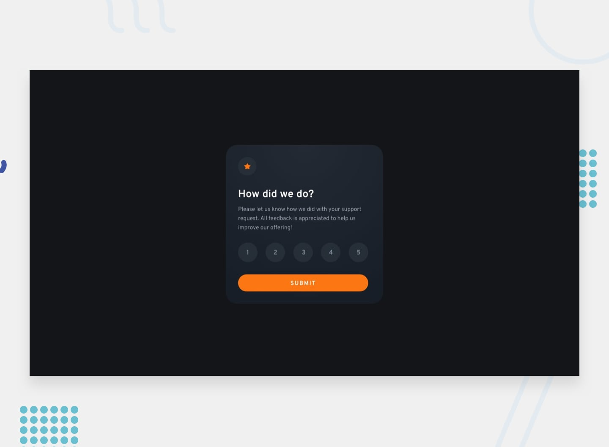
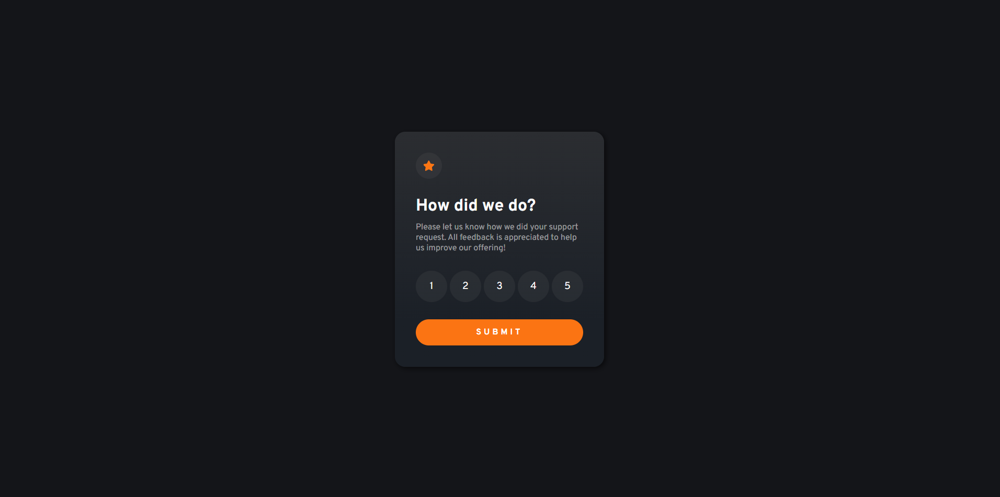

# Frontend Mentor - Interactive Rating Component

This is a solution to the [Interactive Rating Component](https://www.frontendmentor.io/challenges/interactive-rating-component-koxpeBUmI/hub). Frontend Mentor challenges help you improve your coding skills by building realistic projects. 

### The challenge

Users should be able to:

- Select and submit a number rating
- See the "Thank you" card state after submitting a rating
- See hover and focus states for all interactive elements on the page
### Screenshot
- Desktop Design:

- Desktop Design 2:

- Mobile Design:

- Mobile Design 2:

### Links

- Challenge URL: [Challenge](https://www.frontendmentor.io/challenges/interactive-rating-component-koxpeBUmI)
- Live Site URL: [Site](https://interactive-rating-component-nott.netlify.app/)

### Built with

- React

## Author
- Frontend Mentor - [@nott7](https://www.frontendmentor.io/profile/nott7)
- Twitter - [@gabrynott](https://www.twitter.com/gabrynott)
- LinkedIn - [Gabriele Notonica](https://www.linkedin.com/in/gabriele-notonica-a28080253/)
